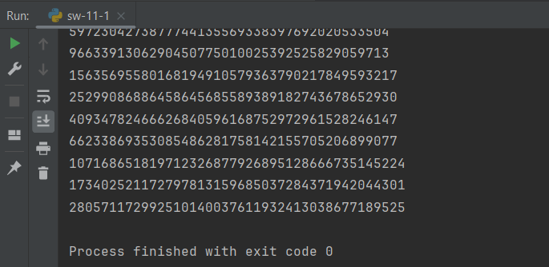
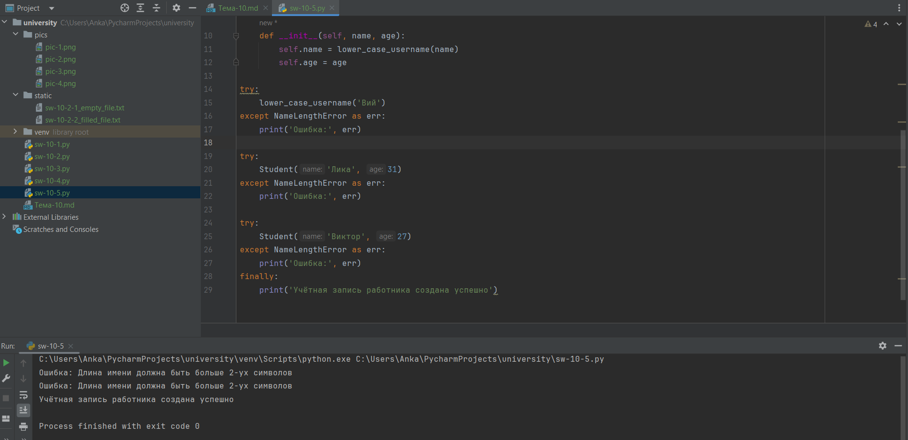

# Тема 3. Операторы, условия, циклы
Отчет по Теме #3 выполнил(а):
- Иванников Вадим Вячеславович
- ЗПИЭ-20-1

| Задание    | Сам_раб |
|------------|---------|
| Задание 1  | +       |
| Задание 2  | +       |
| Задание 3  | +       |
| Задание 4  | +       |
| Задание 5  | +       |

Знак "+" - задание выполнено; знак "-" - задание не выполнено;

Работу проверили:
- к.э.н., доцент Панов М.А.

## Самостоятельная работа №1
### Напишите программу, которая преобразует 1 в 31.

```python
value = 1

for i in range(2):
    value *=5
    value +=1

print(value)
```
### Результат.


## Вывод

Для того чтобы преобразовать число 1 в 31 достаточно 2 раза запустить цикл for и выполнить необходимые операции.

## Самостоятельная работа №2
### Напишите программу, которая фразу "Hello World" выводит в обратном порядке, и каждая буква находится в одной строке консоли. 

```python
str = 'Hello World'
for i in range(len(str)):
    print(str[len(str) - 1 - i])
```


## Вывод

При помощи цикла for и функции range() можно пробежаться по всей строке и вывести каждую букву отдельно. Чтобы выводить буквы с конца нужно из длины слова вычитать текущий индекс.

## Самостоятельная работа №3
###  Напишите программу, на вход которой поступает значение из консоли, оно должно быть числовым и в диапазоне от 0 до 10 включительно (это необходимо учесть в программе). Если видимое число не подходит по требованиям, то необходимо вывести оповещение об этом в консоль и остановить программу. Код должен вычислять в каком диапазоне находится полученное число.

```python
value = int(input('Введите число от 0 до 10 включительно: '))

if value >= 0 and value <= 3:
    print('от 0 до 3 включительно')
elif value > 3 and value < 6:
    print('от 3 до 6')
elif value >= 6 and value <= 10:
    print('от 6 до 10 включительно')
else:
    print('Указано некорректное значение')
```


## Вывод

Благодаря конструкции if..elif..else можно определить в каком диапазоне находится число.
  
## Самостоятельная работа №4
### Манипулирование строками. Напишите программу Python, которая принимает предложение (на английском) в качестве входных данных от пользователя.

```python
value = input('Введите предложение: ')

print('Длина предложения:', len(value))
print('Предложение в нижнем регистре:', value.lower())

words = 0
for i in range(len(value)):
    if value[i] in ['a', 'e', 'i', 'o', 'u']:
        words += 1
print('Количество гласных в предложении:', words)

print('Замена "ugly" на "beauty":', value.replace('ugly', 'beauty'))
print('Предложение начинается на The:', 'да' if value.find('The') == 0 else 'нет')
print('Предложение заканчивается на end:', 'да' if value.find('end') == len(value) - len('end') else 'нет')
```


## Вывод

Чтобы узнать длину предложения можно воспользоваться функцией len(). Чтобы предложение привести в нижний регистр можно воспользоваться функцией lower(). Чтобы подсчитать количество гласных можно циклом пробежаться по строке и проверить каждую букву. Чтобы заменить одну подстроку на другую можно воспользоваться функцией replace(). Чтобы проверить, начинается ли строка на определённую подстроку, то можно воспользоваться функцией find() для получения индекса начала подстроки и сравнить полученное значение с 0. И чтобы проверить, заканчивается ли строка на определённую подстроку, то можно воспользоваться функцией find() для получения индекса подстроки и проверить результат.

## Самостоятельная работа №5
### Составьте программу, результатом которой будет данный вывод в консоль:

```python
values = [0, 2, 4, 6, 8, 10]
counter = 0
string = 'hello'
while counter != 10:
    memory = string
    if counter in values:
        string = string + ' world'
    print(string)
    string = memory
    counter += 1
memory = ' world'
print(string + memory)
```



## Вывод

С помощью готовых кусков кода можно сделать приложение.

## Общие выводы по теме

В python есть операторы для арифметических выражений: +, -, *, **, /, //
В python есть логические операторы: or, and, not