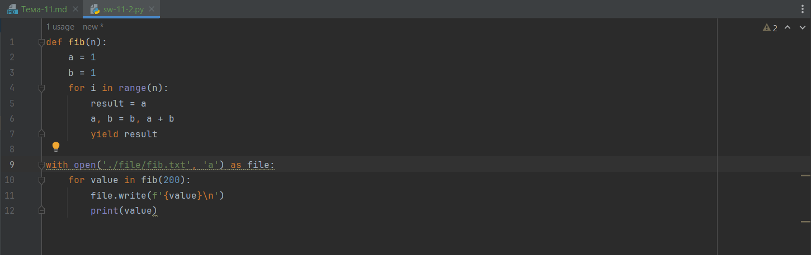

# Тема 7. Работа с файлами (ввод, вывод)
Отчет по Теме #7 выполнил(а):
- Иванников Вадим Вячеславович
- ЗПИЭ-20-1

| Задание    | Сам_раб |
|------------|---------|
| Задание 1  | +       |
| Задание 2  | +       |
| Задание 3  | +       |
| Задание 4  | +       |
| Задание 5  | +       |

Знак "+" - задание выполнено; знак "-" - задание не выполнено;

Работу проверили:
- к.э.н., доцент Панов М.А.

## Самостоятельная работа №1
### Найдите в интернете любую статью (объем статьи не менее 200 слов), скопируйте ее содержимое в файл и напишите программу, которая считает количество слов в текстовом файле и определит самое часто встречающееся слово. Результатом выполнения задачи будет: скриншот файла со статьей, листинг кода, и вывод в консоль, в котором будет указана вся необходимая информация.

```python
import re


def get_ofter_word(value):
    dictionary = {}
    for x in value:
        if x in dictionary:
            dictionary[x] = dictionary[x] + 1
        else:
            dictionary[x] = 1
    dictionary_to_list = list(dictionary.items())
    dictionary_to_list.sort(reverse=True, key=lambda x: x[1])

    return dictionary_to_list[0:1][0]


with open('static/stat.txt', 'r') as file:
    content = file.read()
    content_without_spectial_chars = re.sub(r'[^a-zA-Zа-яА-я0-9]', ' ', content)
    content_without_double_spaces = re.sub(r' {2,}', ' ', content_without_spectial_chars)
    splitted_content = content_without_double_spaces.split(' ')
    often_word = get_ofter_word(splitted_content)
    print('Всего слов:', len(splitted_content))
    print(f'Чаще всего встречается слово "{often_word[0]}". Оно встречается {often_word[1]} раз(а)')
```

### Результат.




## Вывод

Я разбил каждую строку на отдельные слова при помощи функции `split()`
После чего посчитал общее количество слов при помощи функции `len()` и самое частое слово при помощи словаря.

## Самостоятельная работа №2
### У вас появилась потребность в ведении книги расходов, посмотрев все существующие варианты вы пришли к выводу что вас ничего не устраивает и нужно все делать самому. Напишите программу для учета расходов. Программа должна позволять вводить информацию о расходах, сохранять ее в файл и выводить существующие данные в консоль. Ввод информации происходит через консоль. Результатом выполнения задачи будет: скриншот файла с учетом расходов, листинг кода, и вывод в консоль, с демонстрацией работоспособности программы.

```python
with open('static/sw-7-2.txt', 'a') as file:
    date = input('Введите дату: ')
    category = input('Введите категорию: ')
    sum = int(input('Введите сумму: '))

    file.write(f'{date}\t\t\t{category}\t\t\t{sum}\n')

with open('static/sw-7-2.txt', 'r') as file:
    print('Учёт расходов:\n', file.read())
```

### Результат.


## Вывод

С помощью режима добавления (`a`) мы вносим новую информацию от пользователя;
После чего с помощью режима чтения (`r`) отображаем ранее введённую информацию.

## Самостоятельная работа №3
### Имеется файл input.txt с текстом на латинице. Напишите программу, которая выводит следующую статистику по тексту: количество букв латинского алфавита; число слов; число строк.

```python
alphabet = ['a', 'b', 'c', 'd', 'e', 'f', 'g', 'h', 'i', 'k', 'l', 'm', 'n', 'o', 'p', 'q', 'r', 's', 't', 'u', 'v', 'x', 'y', 'z']

with open('./static/Sam7_3_input.txt', 'r') as file:
    lines = file.readlines()
    count_letters = 0
    count_words = 0

    for line in lines:
        for word in line.strip():
            if word.lower() in alphabet:
                count_letters += 1
        count_words += len(line.split(' '))

    print('Input file contains:')
    print(f'{count_letters} letters')
    print(f'{count_words} letters')
    print(f'{len(lines)} lines')
```

### Результат.


## Вывод

При помощи цикла можно посчитать количество слов; При помощи вложенного цикла можно посчитать все буквы в тексте; При помощи функции `len()` можно посчитать количество строк в тексте.

## Самостоятельная работа №4
### Напишите программу, которая получает на вход предложение, выводит его в терминал, заменяя все запрещенные слова звездочками * (количество звездочек равно количеству букв в слове). Запрещенные слова, разделенные символом пробела, хранятся в текстовом файле input.txt. Все слова в этом файле записаны в нижнем регистре. Программа должна заменить запрещенные слова, где бы они ни встречались, даже в середине другого слова. Замена производится независимо от регистра: если файл input.txt содержит запрещенное слово exam, то слова exam, Exam, ExaM, EXAM и exAm должны быть заменены на ****.

```python
example_1 = 'Hello, world! Python IS the programming language of thE future. My\nEMAIL is....\nPYTHON is awesome!!!!'

with open('./static/Sam7_4_input.txt', 'r') as file:
    words = file.read().split(' ')
    lower_text = example_1.lower()

    for word in words:
        lower_text = lower_text.replace(word, '*' * len(word))

    result = ''

    for index, word in enumerate(lower_text):
        if example_1[index].lower() == word:
            result += example_1[index]
        else:
            result += word

    print(result)
```

### Результат.


## Вывод

Сперва приводим строку к нижнему регистру и заменяем все необходимые слова на `*`. Затем восстанавливаем регистр символов при помощи первоначальной строки.

## Самостоятельная работа №5
### Имеется два файла с текстом. Необходимо поменять содержимое файла местами

```python
content_A = ''
content_B = ''

with open('./static/Sam7_5_a.txt', 'r') as file:
    content_A = file.read()

with open('./static/Sam7_5_b.txt', 'r') as file:
    content_B = file.read()

with open('./static/Sam7_5_a.txt', 'w') as file:
    file.write(content_B)

with open('./static/Sam7_5_b.txt', 'w') as file:
    file.write(content_A)
```

### Результат.


## Вывод

Нам необходимо, сначала прочитать данные из файла и сохранить его в переменную, после чего поменять их местами.

## Общие выводы по теме

Python имеет широкие возможности для работы с файлами. Можно создавать файл, прочитать файл и записывать файлы. Чтение можно выполнять, как целиком так, и построчно.