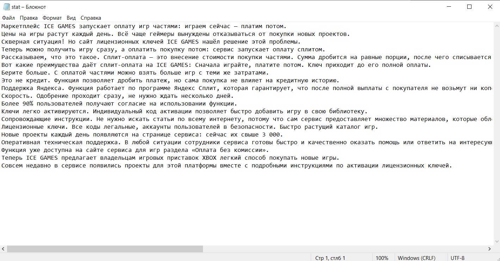
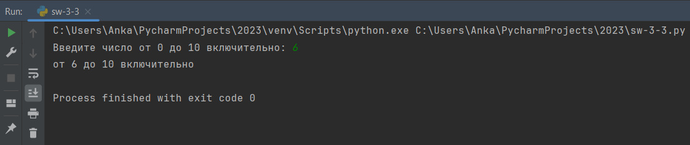
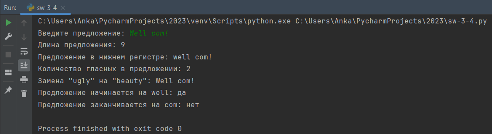
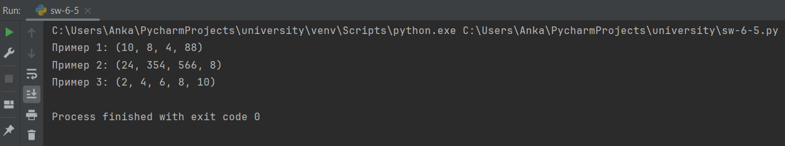

# Тема 8. Введение в ООП
Отчет по Теме #8 выполнил(а):
- Иванников Вадим Вячеславович
- ЗПИЭ-20-1

| Задание    | Сам_раб |
|------------|---------|
| Задание 1  | +       |
| Задание 2  | +       |
| Задание 3  | +       |
| Задание 4  | +       |
| Задание 5  | +       |

Знак "+" - задание выполнено; знак "-" - задание не выполнено;

Работу проверили:
- к.э.н., доцент Панов М.А.

## Самостоятельная работа №1
### Самостоятельно создайте класс и его объект. Они должны отличаться, от тех, что указаны в теоретическом материале (методичке) и лабораторных заданиях. Результатом выполнения задания будет листинг кода и получившийся вывод консоли.

```python
class Fish:
    def __init__(self, name, weight):
        self.name = name
        self.weight = weight

my_fish = Fish('karp', 3)

print(my_fish.name)
print(my_fish.weight)
```

### Результат.


## Вывод

В Python можно создавать классы и тем самым использовать парадигму ООП.

## Самостоятельная работа №2
### Самостоятельно создайте атрибуты и методы для ранее созданного класса. Они должны отличаться, от тех, что указаны в теоретическом материале (методичке) и лабораторных заданиях. Результатом выполнения задания будет листинг кода и получившийся вывод консоли.

```python
class Fish:
    def __init__(self, name, weight, speed):
        self.name = name
        self.weight = weight
        self.speed = speed

    def run(self):
        print(f'Я плыву со скоростью {self.speed}')


my_fish = Fish('karp', 3, 13)

print(my_fish.name)
print(my_fish.weight)
my_fish.run()
```

### Результат.



## Вывод

Для класса были добавлены аттрибуты `speed` и `run()`, которое выводят в консоль сообщение и сообщают о скорости передвижения.

## Самостоятельная работа №3
### Самостоятельно реализуйте наследование, продолжая работать с ранее созданным классом. Оно должно отличаться, от того, что указано в теоретическом материале (методичке) и лабораторных заданиях. Результатом выполнения задания будет листинг кода и получившийся вывод консоли.

```python
class Fish:
    def __init__(self, name, weight, speed):
        self.name = name
        self.weight = weight
        self.speed = speed

    def run(self):
        print(f'Я плыву со скоростью {self.speed}')

class Fish(Fish):
    def __init__(self, name, weight, speed):
        super().__init__(name, weight, speed)

    def bup(self):
        print('bupbup')

my_fish = Fish('kurp', 3, 13)

print(my_fish.name)
print(my_fish.weight)
my_fish.bup()
```

### Результат.



## Вывод

Наследование в Python является мощным инструментом в ООП для, пере использования и композиции кода.

## Самостоятельная работа №4
### Самостоятельно реализуйте инкапсуляцию, продолжая работать с ранее созданным классом. Она должна отличаться, от того, что указана в теоретическом материале (методичке) и лабораторных заданиях. Результатом выполнения задания будет листинг кода и получившийся вывод консоли.

```python
class Fish:
    def __init__(self, name, weight, speed):
        self.name = name
        self.weight = weight
        self.speed = speed
    def run(self):
        print(f'Я плыву со скоростью {self.speed}')

class Fish(Fish):
    def __init__(self, name, weight, speed, tail_length):
        super().__init__(name, weight, speed)
        self.__tail_length = tail_length
    def bup(self):
        print('bupbup')
    def wag_tail(self):
        print(f'Хвост размером {self.__tail_length} виляет при плавании')

my_fish = Fish('kurp', 3, 13, 2)
# print(my_fish.__tail_length) защищённый аттрибут
my_fish.wag_tail()
```

### Результат.



## Вывод

Инкапсуляция позволяет ограничить доступ к компонентам (методам и переменным).

## Самостоятельная работа №5
### Самостоятельно реализуйте полиморфизм. Он должен отличаться, от того, что указан в теоретическом материале (методичке) и лабораторных заданиях. Результатом выполнения задания будет листинг кода и получившийся вывод консоли.

```python
class Fish(Fish):
    def make_noise(self):
        print('pub...pub...pub')

class Shark(Fish):
    def make_noise(self):
        print('bulk... bulk... bulk')

my_fish = Fish()
my_shark = Shark()

my_fish.make_noise()
my_shark.make_noise()
```

### Результат.



## Вывод

Благодаря полиморфизму для разных классов у нас есть общий интерфейс.

## Общие выводы по теме

Python поддерживает классы, что позволяет писать код в парадигме ООП.